# Color_OCR_image_generator
This code is used to generate some synthesized text pictures with RGB channels to train the text recognition model.
(e.g. [deep-text-recognition](https://github.com/clovaai/deep-text-recognition-benchmark)).
And the length and width of the generated picture is indefinite and the number of words on the picture is also variable.

# Getting Started
### Dependency
- This work was tested with python 3.7,and Ubuntu 18.03. You may need to install the following libraries.  
* `numpy`
* `pickle`
* `PIL(pillow)`
* `sklearn`
* `matplotlib`
* `hashlib`
* `fontTools`
* `cv2(opencv)`

# Examples of generating images
By default, simply run `python3 OCR_image_generator.py` will generate 30 text images with color channels in `output/` and a labels.txt file in current floder. 

## 1.horizontal_text_picture 
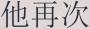
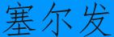

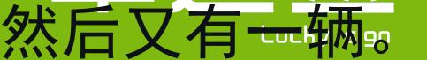

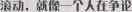 
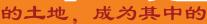 

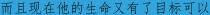 
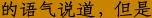

## 2.get_vertical_text_picture 

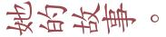
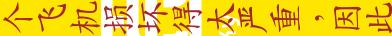

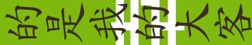

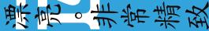
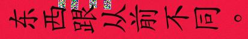

# Code function display
## Running this code to add different parameters can generate text images with different effects, as follows:
Run `python3 OCR_image_generator.py ` will generate the following images 

| parameter  |    Example images 2    |      Example images 2 |        Example images 3 |
| ---         |     ---      |          --- |           --- |
| `--blur `|     |       |     |
| `--prydown`|       |        |   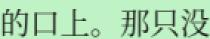  
| `--lr_motion`| 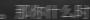  |      |   
| `--ud_motion`| 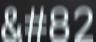      |        |   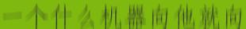    |
|`--random_offset` |     |       |  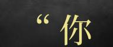  
|`noise_enable` | 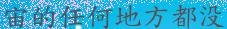    |   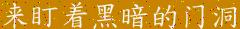    |  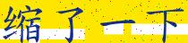  

## Random spaces about generating text
Because the text in the real scene is likely to have a certain gap, if the distance of the text you generate is fixed,
it is likely that the text in the trained model cannot be recognized with too large a gap. This code solves this very well.
This code solves this problem by adding random spaces to the code. The specific effects are as follows: 
|   Example images 2    |      Example images 2 |        Example images 3 |
| ---      |          --- |           --- |
|     |       |     |

Of course, if you know in advance what kind of font color you need, you need to generate this type of images, 
you can also use `--customize_color` parameters to customize the font color.

## About the choice of font color
In this paper, the kmeans clustering method is used to calculate the 8 cluster centers in the LAB space 
based on the background image clipped by the selected text, and then load the color library (including 9882 colors), 
and randomly select No. 500 from the color library. For colors, calculate the sum of the standard deviations of each color
 number and the cluster centers of 8 types, and randomly select one of the first 100 colors as the font color of the generated image. 
 (This can enrich the font color, of course, you can also choose the maximum standard deviation color as the font color)

## About the choice of font and corpus
When your corpus dictionary is very large, the font you choose may not support some of the words in your dictionary,
but if you don’t filter, the generated image is likely to be garbled or blank. This code selects the text and At the same time,
the font is selected to ensure that the currently selected text is in the font.

## About horizontal and vertical text
If you need some vertical text in your scene, you can modify the parameters in the code to change the direction of the generated text.

## Arguments
* `--num_img`: Number of images to generate.
* `--font_min_size`: Can help adjust the size of the generated text and the size of the picture.
* `--font_max_size`: Can help adjust the size of the generated text and the size of the picture.
* `--bg_path`: The generated text pictures will use the pictures of this folder as the background.
* `--fonts_path`: he font used to generate the picture.
* `--corpus_path`: The corpus used to generate the text picture.
* `--color_path`: Color font library used to generate text.
* `--chars_file`: Chars allowed to be appear in generated images.
* `--customize_color`: Support font custom color.
* `--blur`: Apply gauss blur to the generated image.
* `--prydown`: Blurred image, simulating the effect of enlargement of small pictures.
* `--lr_motion`: Apply left and right motion blur.
* `--ud_motion`: Apply up and down motion blur.
* `--random_offset`: Randomly add offset.

# About font files
I sorted out about 700 fonts that can be used in generating OCR text pictures,
Downloaded Baidu Cloud Link as follows: 
 [here1](https://pan.baidu.com/s/1dRp70rEVeauu9rWB7bfGZw). Extraction code:8kzt.   [here2](https://pan.baidu.com/s/1aHkYSxactHm4u5eEiqHDAA). Extraction code:s58p

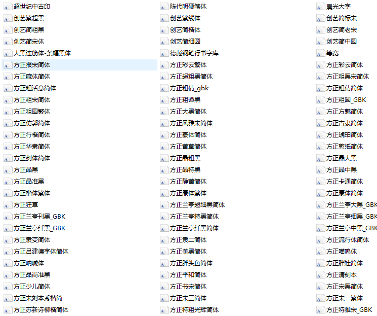

# Tools
You can use `sentence_filter.py` script to select different modes(contains `filter` and `split` model) to 
filter the text and remove the text that is not in the dictionary and to cut the text of different lengths.

# Reference
- https://github.com/Sanster/text_renderer
- https://github.com/wang-tf/Chinese_OCR_synthetic_data

# Contact
Feel free to contact me if there is any question:  
My mail address is jhsignal@126.com; 
